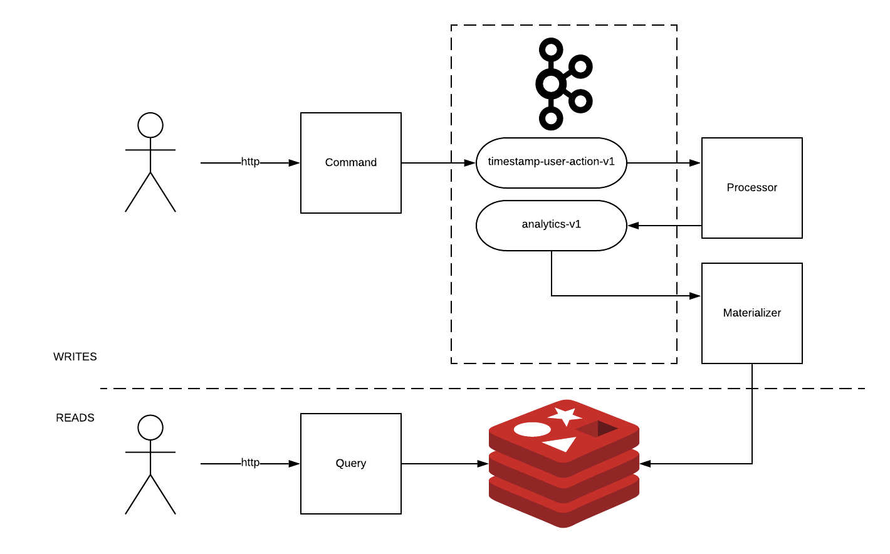
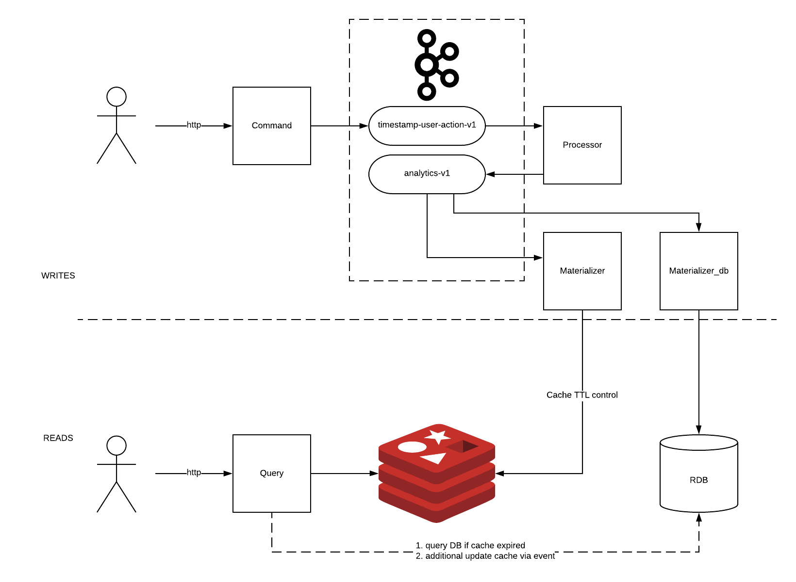

# Tech task
[Task link](https://gist.github.com/jeffreyolchovy/a961dfc3570b7e9004a9df4ac6290963)

## How to run
Execute `make`

```
// write
curl -X POST "http://localhost:8081/analytics?timestamp=123&user=kek&click"
// read
curl "http://localhost:8082/analytics?timestamp=123"
```
## Solution


Eventual consistency. Async writes, Sync reads. Command Query Responsibility Segregation. 

1. `command module` - http server, kafka producer. Post requests. Data validation on ingestion, produce record. 
2. `processor module` - kafka streams application. Business logic (analytics - aggregation)
3. `materializer module` - kafka streams application, redis api. Downstream analytics redis.
4. `query module` - http server, redis api. Get requests. Query redis (cache)  

### Comments 

>The POST and GET endpoints should be optimized for high throughput and low latency.

To satisfy throughput and low latency on 
* WRITES side I chose Apache Kafka, producer api. 
* READS side I chose Redis, server side caching. 

>The server will receive many more GET requests (95%) for the current hour than for hours in the past (5%).

Server side caching on redis should be enough for the first deployments. 
But it should be ttl caching control. Once Materializer does downstream data, it could setup TTL: timestamp + 60 minutes. 
Potentially could be expired and do not upserted into redis. 
TTL caching control is also required additional mechanism to update cache for (5% GET request which is behind last hour).
For instance it could be relational database for long term storing analytical data.
Mechanism is going to include direct query to db if cache expired, produce event to update cache for specific key, additional service(s) to update cache.

Once limits are going to be reached on READS side, it is directly relate to caching, 
I propose **evaluate** other caching placement strategies:
* caching on server side (redis, proxy, gateway, AWS CloudFront with edge locations and other cloud vendors analogs)
* caching on client side
* hybrid server & client side

Why evaluate, because of complexity of cache consistency. Check improvements.
Also there are possibility to scale redis. 

Once limits are going to be reached on WRITES side, it relates to several things:
* Kafka producer tuning (delivery semantics, connection amount, serialization, ...)
* Command module scaling
* Kafka cluster's quotas
* Kafka cluster size 

I propose to inspect each of these reasons to tune it better.

### Limitations
* processor and materializer scale up to number of partitions
* CAP theorem
 
### Improvements
0. Testing
1. External kafka config
2. Serde with Avro, Protobuf, ...
3. Materializer flow control (throttling, buffering, non-blocking). Reactive
4. Cache ttl control and additional database for long term storing
5. Health-checks, circuit breaker
6. Container orchestration (k8s, nomad)
7. Proxy, gateway on front
8. Service discovery
9. Schema management (AVRO -> schema registry) 
10. Observability (logging, tracing, metrics)
11. Optimize better (profiling, benchmarking)
12. Security




